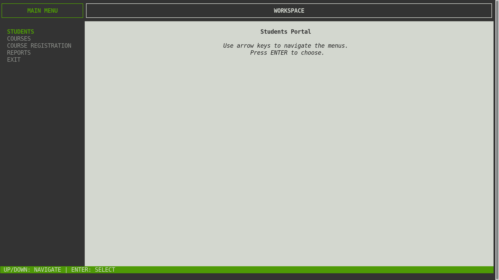
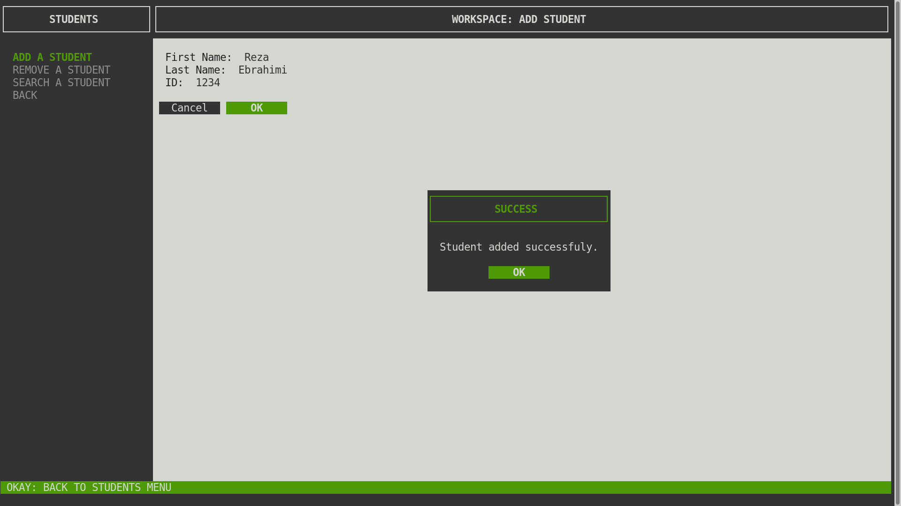
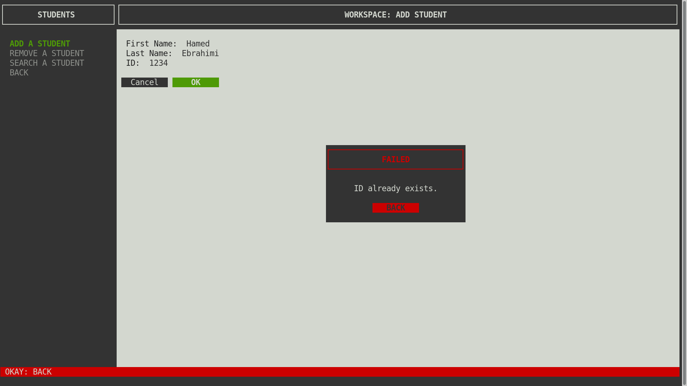
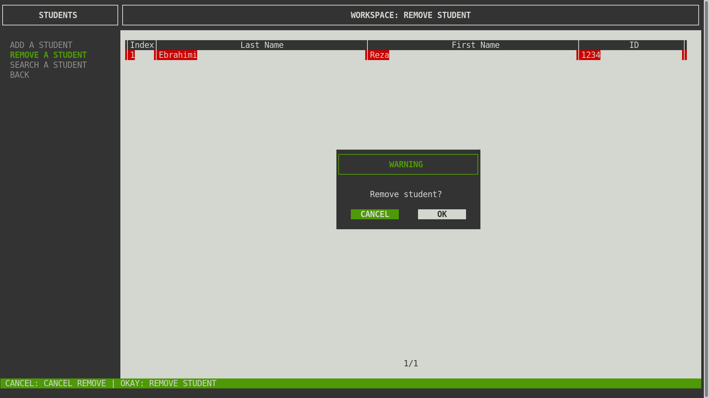
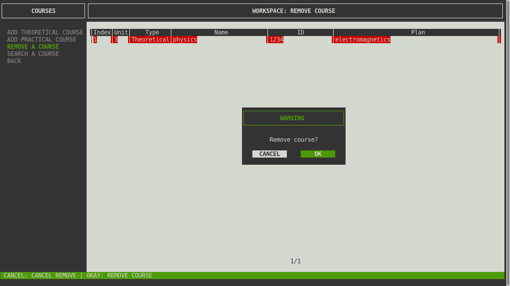
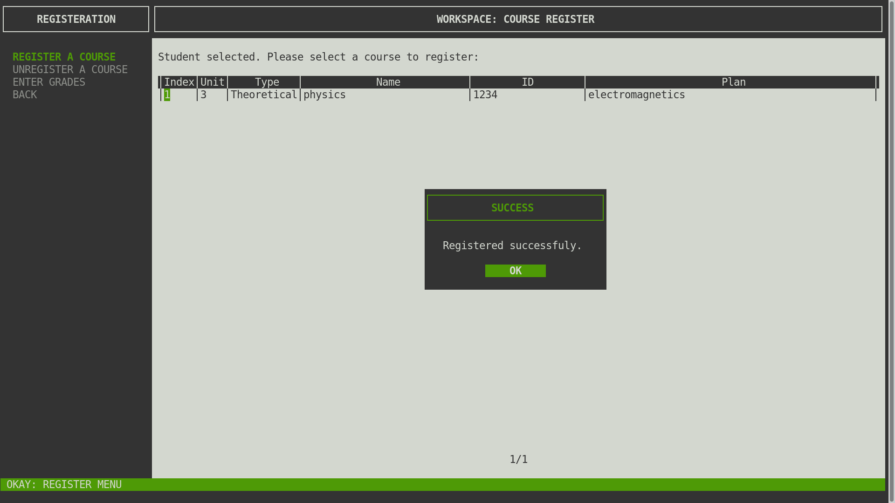
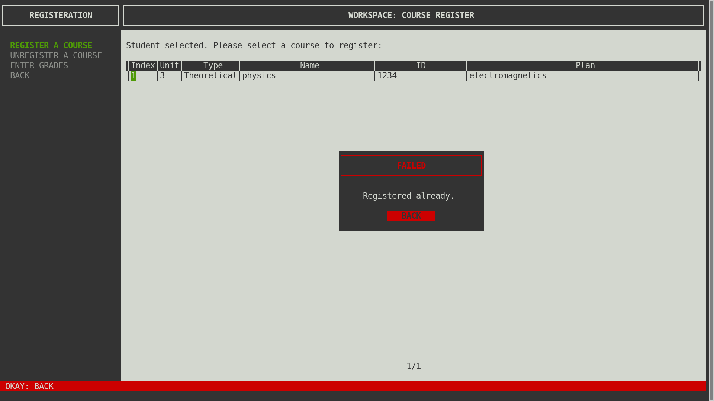
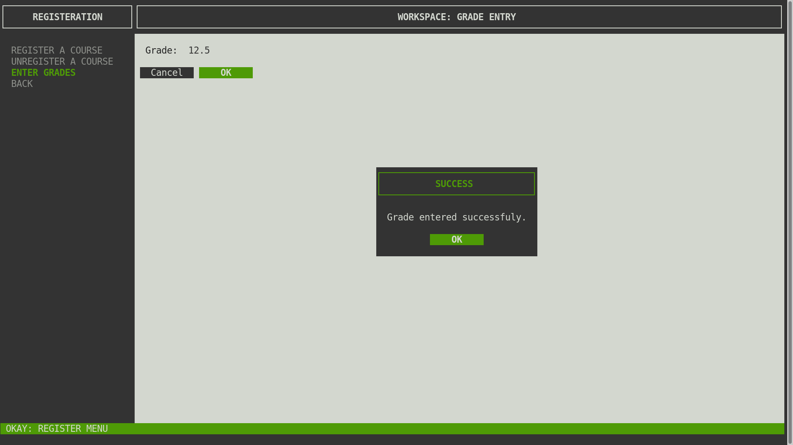
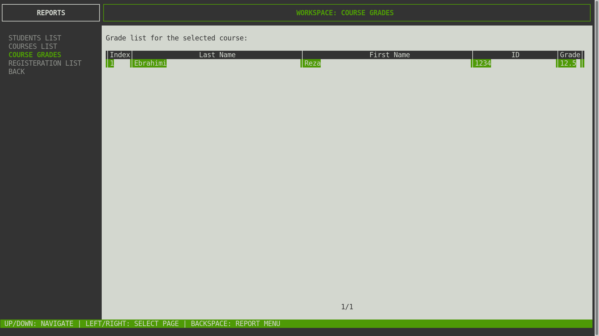

# Student Course Management C++ Ncurses

A sample C++ program to manage students, in c++ using ncurses. Students and courses can be added or removed. Students can register courses, and their grades can be saved.

```bash
mkdir release
make all
release/student_portal.out
```






















